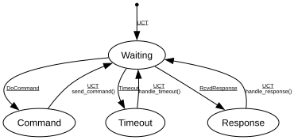

# ACMP Controller

**Implements:** IEEE 1722.1-2021 Clause 8.2.3

| Event | Start | Waiting | Command | Timeout | Response |
|-------|--------|--------|--------|--------|--------|
| UCT | -> Waiting | -x- | send_command() -> Waiting | handle_timeout() -> Waiting | handle_response() -> Waiting |
| DoCommand | -x- | -> Command | -x- | -x- | -x- |
| DoTerminate | -x- | -x- | -x- | -x- | -x- |
| RcvdResponse | -x- | -> Response | -x- | -x- | -x- |
| RcvdOther | -x- | -x- | -x- | -x- | -x- |
| Timeout | -x- | -> Timeout | -x- | -x- | -x- |
