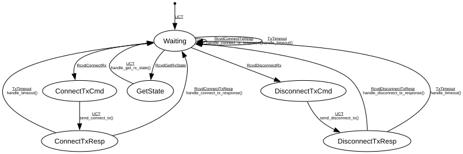

# ACMP Listener

**Implements:** IEEE 1722.1-2021 Clause 8.2.5

| Event | Start | Waiting | ConnectTxCmd | DisconnectTxCmd | ConnectTxResp | DisconnectTxResp | GetState |
|-------|--------|--------|--------|--------|--------|--------|--------|
| UCT | -> Waiting | -x- | send_connect_tx() -> ConnectTxResp | send_disconnect_tx() -> DisconnectTxResp | -x- | -x- | handle_get_rx_state() -> Waiting |
| RcvdConnectRx | -x- | -> ConnectTxCmd | -x- | -x- | -x- | -x- | -x- |
| RcvdDisconnectRx | -x- | -> DisconnectTxCmd | -x- | -x- | -x- | -x- | -x- |
| RcvdGetRxState | -x- | -> GetState | -x- | -x- | -x- | -x- | -x- |
| RcvdConnectTxResp | -x- | handle_connect_tx_response() -> Waiting | -x- | -x- | handle_connect_tx_response() -> Waiting | -x- | -x- |
| RcvdDisconnectTxResp | -x- | -x- | -x- | -x- | -x- | handle_disconnect_tx_response() -> Waiting | -x- |
| TxTimeout | -x- | handle_timeout() -> Waiting | -x- | -x- | handle_timeout() -> Waiting | handle_timeout() -> Waiting | -x- |
