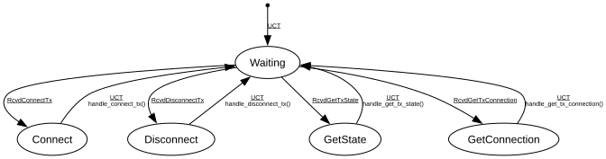

# ACMP Talker

**Implements:** IEEE 1722.1-2021 Clause 8.2.4

| Event | Start | Waiting | Connect | Disconnect | GetState | GetConnection |
|-------|--------|--------|--------|--------|--------|--------|
| UCT | -> Waiting | -x- | handle_connect_tx() -> Waiting | handle_disconnect_tx() -> Waiting | handle_get_tx_state() -> Waiting | handle_get_tx_connection() -> Waiting |
| RcvdConnectTx | -x- | -> Connect | -x- | -x- | -x- | -x- |
| RcvdDisconnectTx | -x- | -> Disconnect | -x- | -x- | -x- | -x- |
| RcvdGetTxState | -x- | -> GetState | -x- | -x- | -x- | -x- |
| RcvdGetTxConnection | -x- | -> GetConnection | -x- | -x- | -x- | -x- |
