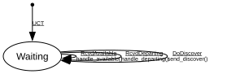

# ADP Discovery

**Implements:** IEEE 1722.1-2021 Clause 6.2.4

| Event | Start | Waiting |
|-------|--------|--------|
| UCT | -> Waiting | -x- |
| RcvdAvailable | -x- | handle_available() -> Waiting |
| RcvdDeparting | -x- | handle_departing() -> Waiting |
| DoDiscover | -x- | send_discover() -> Waiting |
