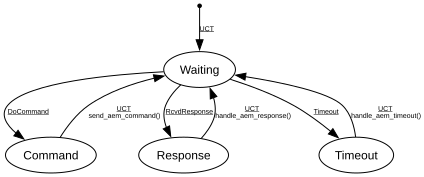

# AECP AEM Controller

**Implements:** IEEE 1722.1-2021 Clause 9.2.1.2.5

| Event | Start | Waiting | Command | Response | Timeout |
|-------|--------|--------|--------|--------|--------|
| UCT | -> Waiting | -x- | send_aem_command() -> Waiting | handle_aem_response() -> Waiting | handle_aem_timeout() -> Waiting |
| DoCommand | -x- | -> Command | -x- | -x- | -x- |
| RcvdResponse | -x- | -> Response | -x- | -x- | -x- |
| Timeout | -x- | -> Timeout | -x- | -x- | -x- |
