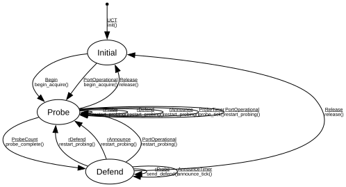

# MAAP (Multicast Address Acquisition Protocol)

**Implements:** IEEE 1722-2025 Annex B.3

| Event | Start | Initial | Probe | Defend |
|-------|--------|--------|--------|--------|
| UCT | init() -> Initial | -x- | -x- | -x- |
| Begin | -x- | begin_acquire() -> Probe | -x- | -x- |
| Release | -x- | -x- | release() -> Initial | release() -> Initial |
| rProbe | -x- | -x- | restart_probing() -> Probe | send_defend() -> Defend |
| rDefend | -x- | -x- | restart_probing() -> Probe | restart_probing() -> Probe |
| rAnnounce | -x- | -x- | restart_probing() -> Probe | restart_probing() -> Probe |
| ProbeCount | -x- | -x- | probe_complete() -> Defend | -x- |
| AnnounceTimer | -x- | -x- | -x- | announce_tick() -> Defend |
| ProbeTimer | -x- | -x- | probe_tick() -> Probe | -x- |
| PortOperational | -x- | begin_acquire() -> Probe | restart_probing() -> Probe | restart_probing() -> Probe |
