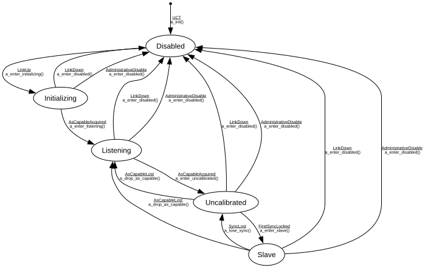

# gPTP Slave-Role Port FSM

**Implements:** IEEE 802.1AS-2020 Clause 10 (slave-only lifecycle abstraction over PortSyncSyncReceive / MDPdelayReq / SiteSyncSync)

| Event | Start | Disabled | Initializing | Listening | Uncalibrated | Slave |
|-------|--------|--------|--------|--------|--------|--------|
| UCT | a_init() -> Disabled | -x- | -x- | -x- | -x- | -x- |
| LinkUp | -x- | a_enter_initializing() -> Initializing | -x- | -x- | -x- | -x- |
| LinkDown | -x- | -x- | a_enter_disabled() -> Disabled | a_enter_disabled() -> Disabled | a_enter_disabled() -> Disabled | a_enter_disabled() -> Disabled |
| AsCapableAcquired | -x- | -x- | a_enter_listening() -> Listening | a_enter_uncalibrated() -> Uncalibrated | -x- | -x- |
| AsCapableLost | -x- | -x- | -x- | -x- | a_drop_as_capable() -> Listening | a_drop_as_capable() -> Listening |
| FirstSyncLocked | -x- | -x- | -x- | -x- | a_enter_slave() -> Slave | -x- |
| SyncLost | -x- | -x- | -x- | -x- | -x- | a_lose_sync() -> Uncalibrated |
| AdministrativeDisable | -x- | -x- | a_enter_disabled() -> Disabled | a_enter_disabled() -> Disabled | a_enter_disabled() -> Disabled | a_enter_disabled() -> Disabled |
