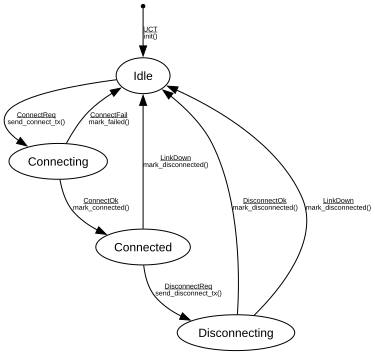

# ACMP Listener

**Implements:** IEEE 1722.1-2021 Clause 8.2.5 (minimal entity-side connection-state tracker)

| Event | Start | Idle | Connecting | Connected | Disconnecting |
|-------|--------|--------|--------|--------|--------|
| UCT | init() -> Idle | -x- | -x- | -x- | -x- |
| ConnectReq | -x- | send_connect_tx() -> Connecting | -x- | -x- | -x- |
| ConnectOk | -x- | -x- | mark_connected() -> Connected | -x- | -x- |
| ConnectFail | -x- | -x- | mark_failed() -> Idle | -x- | -x- |
| DisconnectReq | -x- | -x- | -x- | send_disconnect_tx() -> Disconnecting | -x- |
| DisconnectOk | -x- | -x- | -x- | -x- | mark_disconnected() -> Idle |
| LinkDown | -x- | -x- | -x- | mark_disconnected() -> Idle | mark_disconnected() -> Idle |
