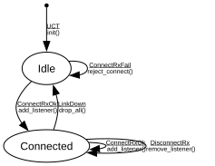

# ACMP Talker

**Implements:** IEEE 1722.1-2021 Clause 8.2.4 (minimal entity-side connection-state tracker)

| Event | Start | Idle | Connected |
|-------|--------|--------|--------|
| UCT | init() -> Idle | -x- | -x- |
| ConnectRxOk | -x- | add_listener() -> Connected | add_listener() -> Connected |
| ConnectRxFail | -x- | reject_connect() -> Idle | -x- |
| DisconnectRx | -x- | -x- | remove_listener() -> Connected |
| LinkDown | -x- | -x- | drop_all() -> Idle |
