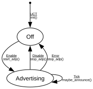

# ADP Advertise

**Implements:** IEEE 1722.1-2021 Clause 6.2.5 (ADP Advertise / entity-side)

| Event | Start | Off | Advertising |
|-------|--------|--------|--------|
| UCT | init() -> Off | -x- | -x- |
| Enable | -x- | start_adp() -> Advertising | -x- |
| Disable | -x- | -x- | stop_adp() -> Off |
| Tick | -x- | -x- | maybe_announce() -> Advertising |
| Error | -x- | -x- | stop_adp() -> Off |
