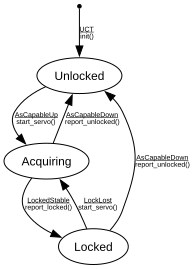

# gPTP Timebase

**Implements:** IEEE 802.1AS-2020 Clause 10 (minimal slave-port lifecycle)

| Event | Start | Unlocked | Acquiring | Locked |
|-------|--------|--------|--------|--------|
| UCT | init() -> Unlocked | -x- | -x- | -x- |
| AsCapableUp | -x- | start_servo() -> Acquiring | -x- | -x- |
| AsCapableDown | -x- | -x- | report_unlocked() -> Unlocked | report_unlocked() -> Unlocked |
| LockedStable | -x- | -x- | report_locked() -> Locked | -x- |
| LockLost | -x- | -x- | -x- | start_servo() -> Acquiring |
