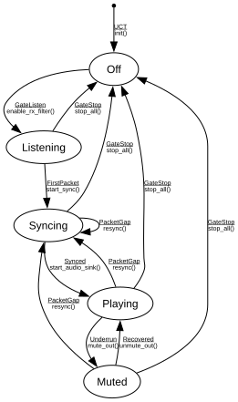

# Listener Engine

**Implements:** (no standard — application-level audio RX pipeline lifecycle)

| Event | Start | Off | Listening | Syncing | Playing | Muted |
|-------|--------|--------|--------|--------|--------|--------|
| UCT | init() -> Off | -x- | -x- | -x- | -x- | -x- |
| GateListen | -x- | enable_rx_filter() -> Listening | -x- | -x- | -x- | -x- |
| FirstPacket | -x- | -x- | start_sync() -> Syncing | -x- | -x- | -x- |
| Synced | -x- | -x- | -x- | start_audio_sink() -> Playing | -x- | -x- |
| GateStop | -x- | -x- | stop_all() -> Off | stop_all() -> Off | stop_all() -> Off | stop_all() -> Off |
| PacketGap | -x- | -x- | -x- | resync() -> Syncing | resync() -> Syncing | resync() -> Syncing |
| Underrun | -x- | -x- | -x- | -x- | mute_out() -> Muted | -x- |
| Recovered | -x- | -x- | -x- | -x- | -x- | unmute_out() -> Playing |
