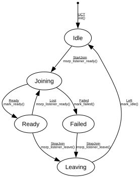

# MSRP Listener

**Implements:** IEEE 802.1Q-2014 Clause 35 (MSRP — Multiple Stream Reservation Protocol, minimal)

| Event | Start | Idle | Joining | Ready | Failed | Leaving |
|-------|--------|--------|--------|--------|--------|--------|
| UCT | init() -> Idle | -x- | -x- | -x- | -x- | -x- |
| StartJoin | -x- | msrp_listener_ready() -> Joining | -x- | -x- | -x- | -x- |
| StopJoin | -x- | -x- | -x- | msrp_listener_leave() -> Leaving | msrp_listener_leave() -> Leaving | -x- |
| Ready | -x- | -x- | mark_ready() -> Ready | -x- | -x- | -x- |
| Failed | -x- | -x- | mark_failed() -> Failed | -x- | -x- | -x- |
| Lost | -x- | -x- | -x- | msrp_listener_ready() -> Joining | -x- | -x- |
| Left | -x- | -x- | -x- | -x- | -x- | mark_idle() -> Idle |
