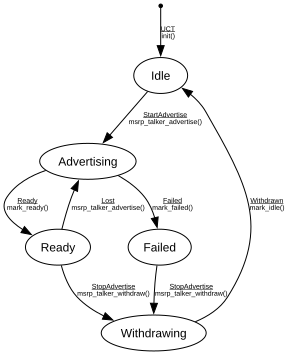

# MSRP Talker

**Implements:** IEEE 802.1Q-2014 Clause 35 (MSRP — Multiple Stream Reservation Protocol, minimal)

| Event | Start | Idle | Advertising | Ready | Failed | Withdrawing |
|-------|--------|--------|--------|--------|--------|--------|
| UCT | init() -> Idle | -x- | -x- | -x- | -x- | -x- |
| StartAdvertise | -x- | msrp_talker_advertise() -> Advertising | -x- | -x- | -x- | -x- |
| StopAdvertise | -x- | -x- | -x- | msrp_talker_withdraw() -> Withdrawing | msrp_talker_withdraw() -> Withdrawing | -x- |
| Ready | -x- | -x- | mark_ready() -> Ready | -x- | -x- | -x- |
| Failed | -x- | -x- | mark_failed() -> Failed | -x- | -x- | -x- |
| Lost | -x- | -x- | -x- | msrp_talker_advertise() -> Advertising | -x- | -x- |
| Withdrawn | -x- | -x- | -x- | -x- | -x- | mark_idle() -> Idle |
