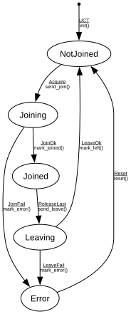

# MVRP VLAN

**Implements:** IEEE 802.1Q-2014 Clause 11 (MVRP — Multiple VLAN Registration Protocol)

| Event | Start | NotJoined | Joining | Joined | Leaving | Error |
|-------|--------|--------|--------|--------|--------|--------|
| UCT | init() -> NotJoined | -x- | -x- | -x- | -x- | -x- |
| Acquire | -x- | send_join() -> Joining | -x- | -x- | -x- | -x- |
| ReleaseLast | -x- | -x- | -x- | send_leave() -> Leaving | -x- | -x- |
| JoinOk | -x- | -x- | mark_joined() -> Joined | -x- | -x- | -x- |
| JoinFail | -x- | -x- | mark_error() -> Error | -x- | -x- | -x- |
| LeaveOk | -x- | -x- | -x- | -x- | mark_left() -> NotJoined | -x- |
| LeaveFail | -x- | -x- | -x- | -x- | mark_error() -> Error | -x- |
| Reset | -x- | -x- | -x- | -x- | -x- | reset() -> NotJoined |
