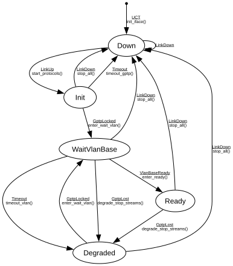

# Device Supervisor

**Implements:** (no standard — application-level orchestrator over the protocol SMs below)

| Event | Start | Down | Init | WaitVlanBase | Ready | Degraded |
|-------|--------|--------|--------|--------|--------|--------|
| UCT | init_iface() -> Down | -x- | -x- | -x- | -x- | -x- |
| LinkUp | -x- | start_protocols() -> Init | -x- | -x- | -x- | -x- |
| LinkDown | -x- | -> Down | stop_all() -> Down | stop_all() -> Down | stop_all() -> Down | stop_all() -> Down |
| GptpLocked | -x- | -x- | enter_wait_vlan() -> WaitVlanBase | -x- | -x- | enter_wait_vlan() -> WaitVlanBase |
| GptpLost | -x- | -x- | -x- | degrade_stop_streams() -> Degraded | degrade_stop_streams() -> Degraded | -x- |
| VlanBaseReady | -x- | -x- | -x- | enter_ready() -> Ready | -x- | -x- |
| Timeout | -x- | -x- | timeout_gptp() -> Down | timeout_vlan() -> Degraded | -x- | -x- |
