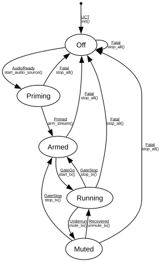

# Talker Engine

**Implements:** (no standard — application-level audio TX pipeline lifecycle)

| Event | Start | Off | Priming | Armed | Running | Muted |
|-------|--------|--------|--------|--------|--------|--------|
| UCT | init() -> Off | -x- | -x- | -x- | -x- | -x- |
| AudioReady | -x- | start_audio_source() -> Priming | -x- | -x- | -x- | -x- |
| Primed | -x- | -x- | arm_stream() -> Armed | -x- | -x- | -x- |
| GateGo | -x- | -x- | -x- | start_tx() -> Running | -x- | -x- |
| GateStop | -x- | -x- | -x- | -x- | stop_tx() -> Armed | stop_tx() -> Armed |
| Underrun | -x- | -x- | -x- | -x- | mute_tx() -> Muted | -x- |
| Recovered | -x- | -x- | -x- | -x- | -x- | unmute_tx() -> Running |
| Fatal | -x- | stop_all() -> Off | stop_all() -> Off | stop_all() -> Off | stop_all() -> Off | stop_all() -> Off |
