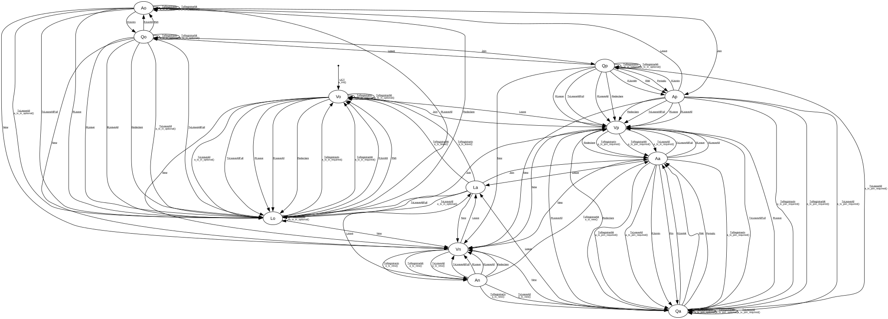

# MRP Applicant

**Implements:** IEEE 802.1Q-2014 Clause 10.7.7

| Event | Start | Vo | Vp | Vn | An | Aa | Qa | La | Ao | Qo | Ap | Qp | Lo |
|-------|--------|--------|--------|--------|--------|--------|--------|--------|--------|--------|--------|--------|--------|
| UCT | a_init() -> Vo | -x- | -x- | -x- | -x- | -x- | -x- | -x- | -x- | -x- | -x- | -x- | -x- |
| New | -x- | -> Vn | -> Vn | -x- | -x- | -> Vn | -> Vn | -> Vn | -> Vn | -> Vn | -> Vn | -> Vn | -> Vn |
| Join | -x- | -> Vp | -x- | -x- | -x- | -x- | -x- | -> Aa | -> Ap | -> Qp | -x- | -x- | -> Vp |
| Leave | -x- | -x- | -> Vo | -> La | -> La | -> La | -> La | -x- | -x- | -x- | -> Ao | -> Qo | -x- |
| TxRegistrarIn | -x- | a_tx_in_optional() -> Vo | a_tx_join_required() -> Aa | a_tx_new() -> An | a_tx_new() -> Qa | a_tx_join_required() -> Qa | a_tx_join_optional() -> Qa | a_tx_leave() -> Vo | a_tx_in_optional() -> Ao | a_tx_in_optional() -> Qo | a_tx_join_required() -> Qa | a_tx_in_optional() -> Qp | a_tx_in_required() -> Vo |
| TxRegistrarMt | -x- | a_tx_in_optional() -> Vo | a_tx_join_required() -> Aa | a_tx_new() -> An | a_tx_new() -> Aa | a_tx_join_required() -> Qa | a_tx_join_optional() -> Qa | a_tx_leave() -> Vo | a_tx_in_optional() -> Ao | a_tx_in_optional() -> Qo | a_tx_join_required() -> Qa | a_tx_in_optional() -> Qp | a_tx_in_required() -> Vo |
| TxLeaveAll | -x- | a_tx_in_optional() -> Lo | a_tx_in_required() -> Aa | a_tx_new() -> An | a_tx_new() -> Qa | a_tx_join_required() -> Qa | a_tx_join_required() -> Qa | a_tx_in_optional() -> Lo | a_tx_in_optional() -> Lo | a_tx_in_optional() -> Lo | a_tx_join_required() -> Qa | a_tx_join_required() -> Qa | a_tx_in_optional() -> Lo |
| TxLeaveAllFull | -x- | -> Lo | -x- | -x- | -> Vn | -> Vp | -> Vp | -> Lo | -> Lo | -> Lo | -> Vp | -> Vp | -x- |
| RNew | -x- | -x- | -x- | -x- | -x- | -x- | -x- | -x- | -x- | -x- | -x- | -x- | -x- |
| RJoinIn | -x- | -x- | -x- | -x- | -x- | -> Qa | -x- | -x- | -> Qo | -x- | -> Qp | -x- | -x- |
| RIn | -x- | -x- | -x- | -x- | -x- | -> Qa | -x- | -x- | -x- | -x- | -x- | -x- | -x- |
| RJoinMt | -x- | -x- | -x- | -x- | -x- | -x- | -> Aa | -x- | -x- | -> Ao | -x- | -> Ap | -> Vo |
| RMt | -x- | -x- | -x- | -x- | -x- | -x- | -> Aa | -x- | -x- | -> Ao | -x- | -> Ap | -> Vo |
| RLeave | -x- | -> Lo | -x- | -x- | -> Vn | -> Vp | -> Vp | -x- | -> Lo | -> Lo | -> Vp | -> Vp | -x- |
| RLeaveAll | -x- | -> Lo | -x- | -x- | -> Vn | -> Vp | -> Vp | -x- | -> Lo | -> Lo | -> Vp | -> Vp | -x- |
| Redeclare | -x- | -> Lo | -x- | -x- | -> Vn | -> Vp | -> Vp | -x- | -> Lo | -> Lo | -> Vp | -> Vp | -x- |
| Periodic | -x- | -x- | -x- | -x- | -x- | -x- | -> Aa | -x- | -x- | -x- | -x- | -> Ap | -x- |
