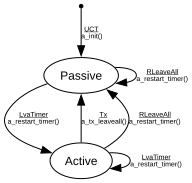

# MRP LeaveAll

**Implements:** IEEE 802.1Q-2014 Clause 10.7.5.22

| Event | Start | Passive | Active |
|-------|--------|--------|--------|
| UCT | a_init() -> Passive | -x- | -x- |
| Tx | -x- | -x- | a_tx_leaveall() -> Passive |
| RLeaveAll | -x- | a_restart_timer() -> Passive | a_restart_timer() -> Passive |
| LvaTimer | -x- | a_restart_timer() -> Active | a_restart_timer() -> Active |
