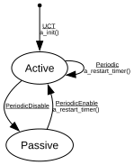

# MRP Periodic

**Implements:** IEEE 802.1Q-2014 Clause 10.7.5.23

| Event | Start | Passive | Active |
|-------|--------|--------|--------|
| UCT | a_init() -> Active | -x- | -x- |
| Periodic | -x- | -x- | a_restart_timer() -> Active |
| PeriodicEnable | -x- | a_restart_timer() -> Active | -x- |
| PeriodicDisable | -x- | -x- | -> Passive |
