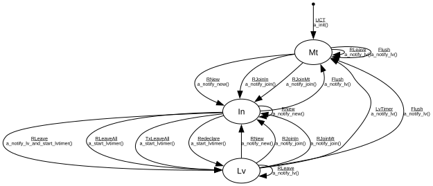

# MRP Registrar

**Implements:** IEEE 802.1Q-2014 Clause 10.7.8 Table 10-4

| Event | Start | In | Lv | Mt |
|-------|--------|--------|--------|--------|
| UCT | a_init() -> Mt | -x- | -x- | -x- |
| RNew | -x- | a_notify_new() -> In | a_notify_new() -> In | a_notify_new() -> In |
| RJoinIn | -x- | -x- | a_notify_join() -> In | a_notify_join() -> In |
| RJoinMt | -x- | -x- | a_notify_join() -> In | a_notify_join() -> In |
| RLeave | -x- | a_notify_lv_and_start_lvtimer() -> Lv | a_notify_lv() -> Lv | a_notify_lv() -> Mt |
| RLeaveAll | -x- | a_start_lvtimer() -> Lv | -x- | -x- |
| TxLeaveAll | -x- | a_start_lvtimer() -> Lv | -x- | -x- |
| Redeclare | -x- | a_start_lvtimer() -> Lv | -x- | -x- |
| LvTimer | -x- | -x- | a_notify_lv() -> Mt | -x- |
| Flush | -x- | a_notify_lv() -> Mt | a_notify_lv() -> Mt | a_notify_lv() -> Mt |
