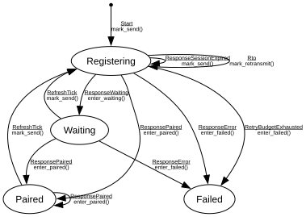

# STUN Client Session

**Implements:** RFC 8489 (STUN) + private REGISTER extension for rendezvous

| Event | Idle | Registering | Waiting | Paired | Failed |
|-------|--------|--------|--------|--------|--------|
| Start | mark_send() -> Registering | -x- | -x- | -x- | -x- |
| ResponseWaiting | -x- | enter_waiting() -> Waiting | -x- | -x- | -x- |
| ResponsePaired | -x- | enter_paired() -> Paired | enter_paired() -> Paired | enter_paired() -> Paired | -x- |
| ResponseError | -x- | enter_failed() -> Failed | enter_failed() -> Failed | -x- | -x- |
| ResponseSessionExpired | -x- | mark_send() -> Registering | -x- | -x- | -x- |
| Rto | -x- | mark_retransmit() -> Registering | -x- | -x- | -x- |
| RetryBudgetExhausted | -x- | enter_failed() -> Failed | -x- | -x- | -x- |
| RefreshTick | -x- | -x- | mark_send() -> Registering | mark_send() -> Registering | -x- |
