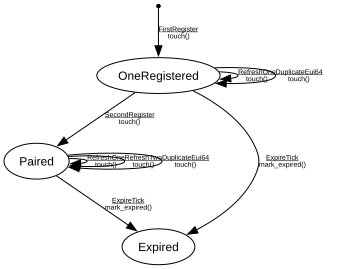

# STUN Server Session

**Implements:** RFC 8489 (STUN) + private REGISTER extension for rendezvous

| Event | Empty | OneRegistered | Paired | Expired |
|-------|--------|--------|--------|--------|
| FirstRegister | touch() -> OneRegistered | -x- | -x- | -x- |
| SecondRegister | -x- | touch() -> Paired | -x- | -x- |
| RefreshOne | -x- | touch() -> OneRegistered | touch() -> Paired | -x- |
| RefreshTwo | -x- | -x- | touch() -> Paired | -x- |
| DuplicateEui64 | -x- | touch() -> OneRegistered | touch() -> Paired | -x- |
| ExpireTick | -x- | mark_expired() -> Expired | mark_expired() -> Expired | -x- |
